<div align="center">

# ✦ ViralSense

### A Multi-Agent Persona Jury and Machine Learning Framework for Predicting Instagram Content Virality

**Will a post land as _Low_, _Moderate_ or _Viral_? ViralSense answers before you publish, explains why, and suggests how to do better.**


-000000)


</div>

| Team member | Registration number |
|---|---|
| **Ayush Upadhyay** | 23BAI1231 |
| **R Rishita** | 24BAI1632 |
| **Avantika Gupta** | 24BAI1633 |

---

## TL;DR

On **3,015 posts from 127 Instagram accounts the model never saw during training**:

| | Macro-F1 | Balanced accuracy | Viral recall | Viral PR-AUC |
|---|---|---|---|---|
| **ViralSense (LightGBM, Optuna-tuned)** | **0.759** | **0.763** | **0.707** | **0.760** |
| Random guessing (stratified dummy) | 0.284 | 0.317 | 0.313 | 0.096 |

- **Engagement score:** a regressor ranks posts by engagement with **Spearman ρ = 0.903**.
- **Where the signal comes from:** most of it is the account's own track record. Image and caption content add a small but **statistically significant** gain on top (+0.017 macro-F1, better in 5 of 5 folds, p = 0.009).
- **The 12-agent AI jury** (a local vision LLM role-playing 12 audience personas) gives believable, explainable reactions. It does **not** improve prediction accuracy, and we report that plainly.
- **Every evaluation is leakage-checked:** account-disjoint splits, strictly-past history features, a negative control on synthetic data, a leakage demonstration and 77 automated tests.

<p align="center">
  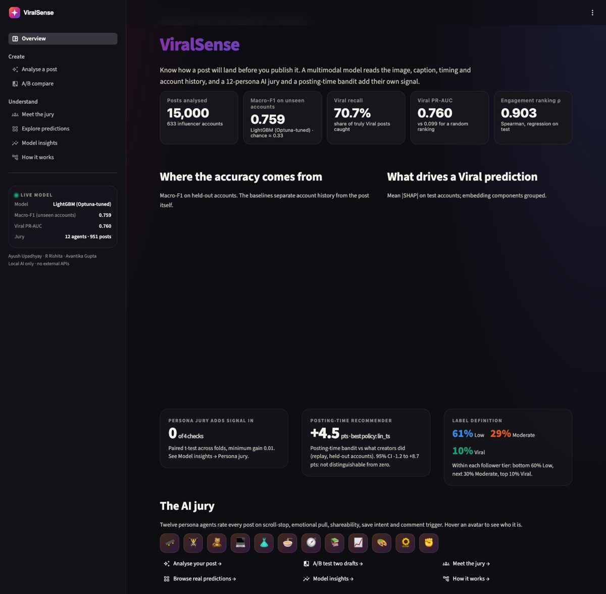
  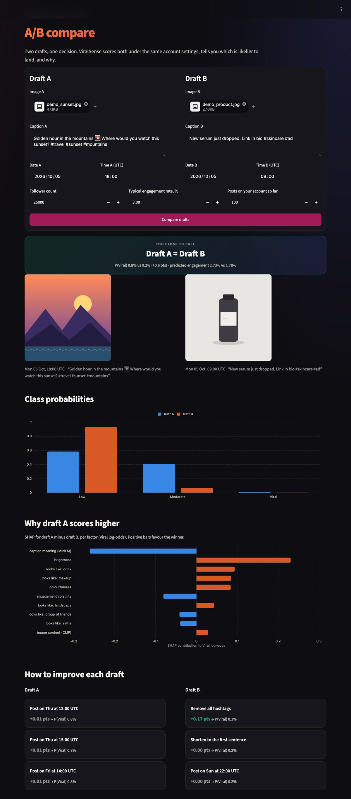
</p>

> All 13 app screenshots are in [§8 Interactive dashboard](#8-phase-5--interactive-dashboard). The demo images in the screenshots
> are synthetic illustrations made for this README; no dataset photos are shown.

---

## Contents

1. [Problem definition](#1-problem-definition)
2. [Dataset](#2-dataset)
3. [System architecture](#3-system-architecture)
4. [Phase 1: Feature engineering](#4-phase-1--feature-engineering)
5. [Phase 2: Multi-agent persona jury](#5-phase-2--multi-agent-persona-jury)
6. [Phase 3: Machine learning models](#6-phase-3--machine-learning-models)
7. [Phase 4: Recommendation (bandits and suggestions)](#7-phase-4--recommendation)
8. [Phase 5: Interactive dashboard](#8-phase-5--interactive-dashboard)
9. [Results](#9-results)
10. [Leakage prevention and validity](#10-leakage-prevention-and-validity)
11. [Engineering](#11-engineering)
12. [How to run](#12-how-to-run)
13. [Limitations and ethics](#13-limitations-and-ethics)
14. [Team contributions](#14-team-contributions)
15. [References](#15-references)

---

## 1. Problem definition

**Input:** a draft post (image, caption, planned time) plus account context (follower count, account history).
**Output:** one of three classes, **Low / Moderate / Viral**, with calibrated probabilities, an explanation and suggestions.

### 1.1 Target: engagement rate

$$
\text{ER} = \frac{\text{likes} + \text{comments}}{\text{followers}}
$$

### 1.2 Labels within follower tiers

A raw ER threshold would be unfair, because big accounts naturally get lower rates. Accounts are therefore grouped into **4 follower tiers** (quartiles of the **training** accounts' follower counts), and labels are assigned **within each tier**:

$$
y =
\begin{cases}
\text{Low} & \text{ER} < q_{0.60}^{(t)} \\
\text{Moderate} & q_{0.60}^{(t)} \le \text{ER} < q_{0.90}^{(t)} \\
\text{Viral} & \text{ER} \ge q_{0.90}^{(t)}
\end{cases}
$$

where $q_p^{(t)}$ is the $p$-quantile of ER among **training** posts in tier $t$. So every tier has the same 60 / 30 / 10 split, and "Viral" means *top 10% for an account of your size*.

| Tier | Followers | Moderate from ER ≥ | Viral from ER ≥ |
|---|---|---|---|
| 1 | < 5,002 | 5.50% | 12.93% |
| 2 | 5,002 – 15,858 | 4.71% | 9.92% |
| 3 | 15,858 – 53,250 | 3.25% | 8.06% |
| 4 | > 53,250 | 3.16% | 6.92% |

**Tier edges and cut-offs are fitted on training accounts only** and then applied unchanged to the test accounts.

---

## 2. Dataset

**Instagram Influencer Dataset** (Kim et al., WWW 2020): 33,935 influencers, 10.18M posts, about 37 GB of post JSON and 189 GB of images, obtained through the authors' research access form.

| | Train | Test | Total |
|---|---|---|---|
| Posts | 11,985 | 3,015 | **15,000** |
| Accounts | 506 | 127 | **633** |
| Median followers | 15,894 | 14,771 | |
| Median engagement rate | 3.15% | 3.06% | |

**Sampling:**
- 640 accounts drawn equally from the 4 follower quartiles of the full population, of which 633 had enough posts.
- Up to 24 **single-image** posts per account, chosen by a seeded hash order.
- The full history of each sampled account (182,357 posts) is parsed to build the history features.

**Efficient data access:**
- **No unzipping:** post JSON is read **in place** from the 19-part split zip by parsing its central directory (`src/viralsense/data/splitzip.py`).
- **No 189 GB download:** only the ~25k images needed are fetched with **HTTP byte-range requests** straight out of the remote archive (`src/viralsense/data/images.py`). That's 0.4 GB instead of 189 GB, a 99.8% reduction.

**Data quality issues found and handled:**
- The released mapping file repeats some rows. These are de-duplicated, with a test.
- 3.5% of mapped posts have no JSON in the archive and are skipped.
- 10 images are missing from the archive; their posts are dropped.

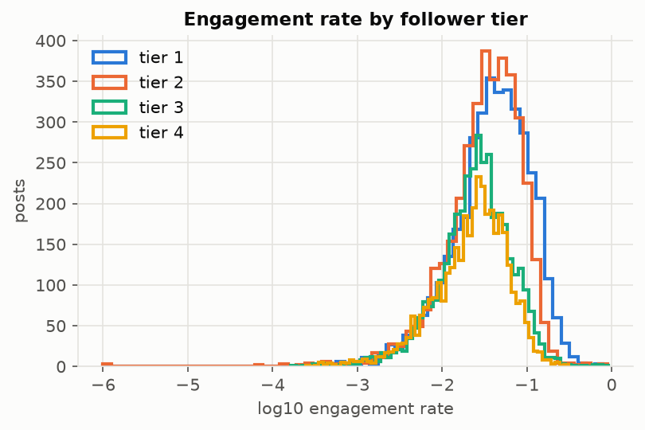

---

## 3. System architecture

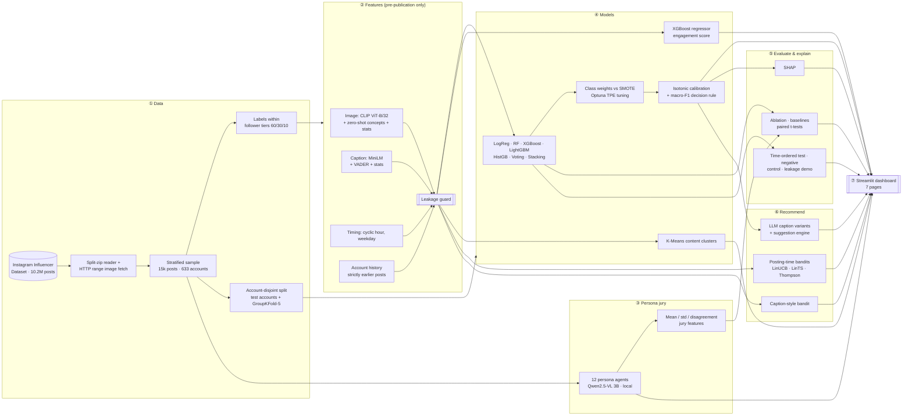
```mermaid
flowchart LR
    subgraph DATA["① Data"]
        D1[(Instagram Influencer<br/>Dataset · 10.2M posts)] --> D2[Split-zip reader +<br/>HTTP range image fetch]
        D2 --> D3[Stratified sample<br/>15k posts · 633 accounts]
        D3 --> D4[Labels within<br/>follower tiers 60/30/10]
        D3 --> D5[Account-disjoint split<br/>test accounts + GroupKFold-5]
    end
    subgraph FEAT["② Features (pre-publication only)"]
        F1[Image: CLIP ViT-B/32<br/>+ zero-shot concepts + stats]
        F2[Caption: MiniLM<br/>+ VADER + stats]
        F3[Timing: cyclic hour, weekday]
        F4[Account history<br/>strictly earlier posts]
        F5[[Leakage guard]]
    end
    subgraph JURY["③ Persona jury"]
        J1[12 persona agents<br/>Qwen2.5-VL 3B · local]
        J2[Mean / std / disagreement<br/>jury features]
    end
    subgraph ML["④ Models"]
        M1[LogReg · RF · XGBoost · LightGBM<br/>HistGB · Voting · Stacking]
        M2[Class weights vs SMOTE<br/>Optuna TPE tuning]
        M3[Isotonic calibration<br/>+ macro-F1 decision rule]
        M4[XGBoost regressor<br/>engagement score]
        M5[K-Means content clusters]
    end
    subgraph EVAL["⑤ Evaluate & explain"]
        E1[SHAP] 
        E2[Ablation · baselines<br/>paired t-tests]
        E3[Time-ordered test · negative<br/>control · leakage demo]
    end
    subgraph REC["⑥ Recommend"]
        R1[Posting-time bandits<br/>LinUCB · LinTS · Thompson]
        R2[Caption-style bandit]
        R3[LLM caption variants<br/>+ suggestion engine]
    end
    APP[["⑦ Streamlit dashboard<br/>7 pages"]]

    D4 --> FEAT
    D5 --> ML
    D3 --> J1 --> J2 --> E2
    F1 & F2 & F3 & F4 --> F5 --> M1
    M1 --> M2 --> M3 --> APP
    F5 --> M4 --> APP
    F5 --> M5 --> APP
    M3 --> E1 --> APP
    M1 --> E2 --> APP
    M1 --> E3 --> APP
    F5 --> R1 --> APP
    F5 --> R2 --> APP
    M3 --> R3 --> APP
    J1 --> APP
```

The dashboard's **How it works** page shows the same architecture as an animated, interactive diagram, with particles flowing along the edges and hover details for every node:

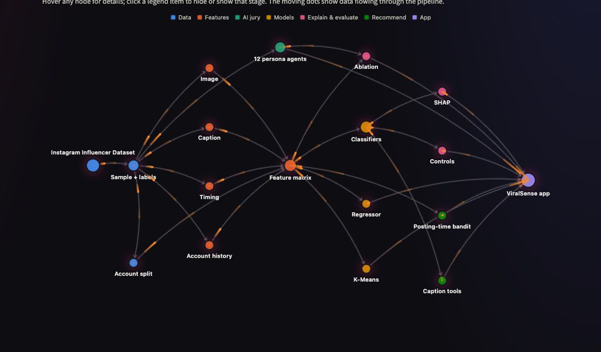

### What happens when you click "Analyse post"

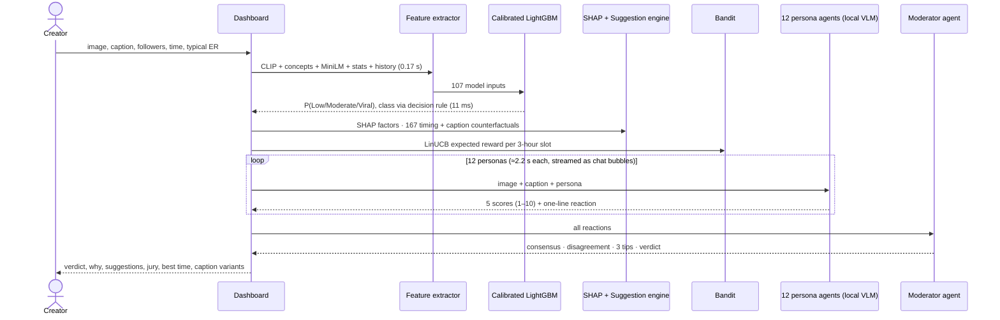
```mermaid
sequenceDiagram
    actor U as Creator
    participant A as Dashboard
    participant F as Feature extractor
    participant M as Calibrated LightGBM
    participant S as SHAP + Suggestion engine
    participant B as Bandit
    participant J as 12 persona agents (local VLM)
    participant L as Moderator agent
    U->>A: image, caption, followers, time, typical ER
    A->>F: CLIP + concepts + MiniLM + stats + history (0.17 s)
    F->>M: 107 model inputs
    M-->>A: P(Low/Moderate/Viral), class via decision rule (11 ms)
    A->>S: SHAP factors · 167 timing + caption counterfactuals
    A->>B: LinUCB expected reward per 3-hour slot
    loop 12 personas (≈2.2 s each, streamed as chat bubbles)
        A->>J: image + caption + persona
        J-->>A: 5 scores (1–10) + one-line reaction
    end
    A->>L: all reactions
    L-->>A: consensus · disagreement · 3 tips · verdict
    A-->>U: verdict, why, suggestions, jury, best time, caption variants
```

---

## 4. Phase 1: Feature engineering

Every feature is **known before posting**. Nothing derived from the post's own likes or comments is ever an input.

### 4.1 Image

| Feature | Definition |
|---|---|
| **CLIP embedding** | OpenCLIP ViT-B/32 (LAION-2B) image embedding $\mathbf{v}\in\mathbb{R}^{512}$, L2-normalised; reduced to 32 dims by **PCA fitted on training folds only** (keeps 44.0% of variance) |
| **Zero-shot concepts** | For 16 concepts $c$ (selfie, food, pet, landscape, product photo, text graphic …): $p(c\mid \text{img}) = \dfrac{\exp(100\,\mathbf{v}^\top\mathbf{t}_c)}{\sum_{c'}\exp(100\,\mathbf{v}^\top\mathbf{t}_{c'})}$ with $\mathbf{t}_c$ the CLIP text embedding of "a photo of *c*" |
| **Brightness** | $\frac{1}{N}\sum_i g_i / 255$ over grey-scale pixels $g_i$ |
| **Contrast** | $\sigma(g)/255$ (RMS contrast) |
| **Colourfulness** | Hasler & Süsstrunk: $rg = R-G$, $yb = \tfrac12(R+G)-B$, $\;C = \sqrt{\sigma_{rg}^2+\sigma_{yb}^2} + 0.3\sqrt{\mu_{rg}^2+\mu_{yb}^2}$ |
| **Face count** | OpenCV Haar-cascade frontal-face detector |

### 4.2 Caption

| Feature | Definition |
|---|---|
| **Sentence embedding** | `all-MiniLM-L6-v2` (384-d) → PCA 32 on training folds (keeps 44.9% of variance) |
| Length, emoji count, hashtag count | counts over the caption text |
| Question flag | $\mathbb{1}[\text{"?" in caption}]$ |
| **Sentiment** | VADER compound score $\in[-1, 1]$ |

### 4.3 Timing and size

$$
\text{hour}_{\sin} = \sin\!\left(\tfrac{2\pi h}{24}\right), \quad \text{hour}_{\cos} = \cos\!\left(\tfrac{2\pi h}{24}\right)
$$

A cyclic encoding, so that 23:00 and 00:00 end up close together. Also: weekday, follower tier, and $\log_{10}(\text{followers})$.

### 4.4 Account history (strictly earlier posts)

For post $i$ at time $\tau_i$ of account $a$, let $\mathcal{P}_i = \lbrace j : a_j = a,\ \tau_j < \tau_i\rbrace$, i.e. **strictly earlier** posts. Posts at the same timestamp are excluded too.

| Feature | Formula |
|---|---|
| Past median ER | $\operatorname{median}\lbrace \text{ER}_j : j\in\mathcal{P}_i\rbrace$ |
| **Recent median ER** | median over the last 10 posts in $\mathcal{P}_i$ |
| ER volatility | $Q_{0.75} - Q_{0.25}$ over $\mathcal{P}_i$ |
| ER trend | $\log\dfrac{\text{recent median}+\epsilon}{\text{past median}+\epsilon}$ |
| Days since last post | $\tau_i - \max_{j\in\mathcal{P}_i}\tau_j$ |
| Posts in last 30 days | $\lvert\lbrace j\in\mathcal{P}_i:\tau_i-\tau_j\le 30\text{d}\rbrace \rvert$ |
| Number of past posts | $\lvert\mathcal{P}_i\rvert$ |

Each history feature is checked against a slow brute-force reference implementation in `tests/test_leakage.py`, including a test that changing a post's own outcome never changes its own features.

### 4.5 What correlates with the label (training accounts, Spearman ρ)

| Feature | ρ with label | Reading |
|---|---|---|
| Recent median ER (last 10) | **0.735** | Strongest single signal |
| Past median ER | 0.666 | |
| ER volatility | 0.611 | |
| ER trend | 0.183 | Rising accounts do better |
| Looks like: product photo | −0.106 | Product shots underperform |
| Looks like: fashion outfit | +0.099 | |
| Looks like: selfie | +0.092 | |
| Looks like: text / quote graphic | −0.078 | |
| Hour, weekday, sentiment, caption length | ≤ 0.02 | Almost no signal |

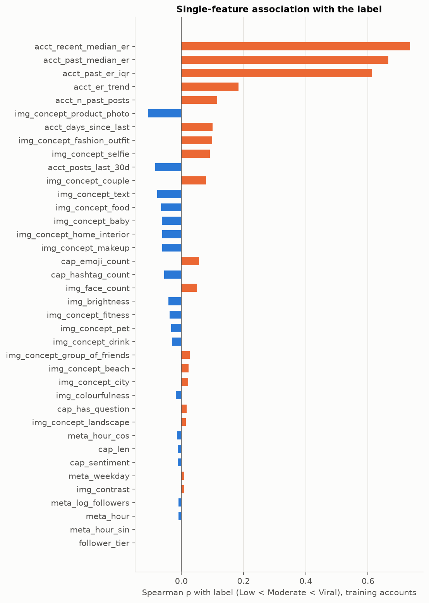

---

## 5. Phase 2: Multi-agent persona jury

Twelve simulated audience members (a Gen-Z meme scroller, a fitness enthusiast, a busy parent, a tech professional, a fashion lover, a foodie, a travel dreamer, a student, a small-business owner, a creative artist, a retired grandparent and a social activist) each look at the **image and caption only, never any numbers**, and rate the post from 1 to 10 on five factors:

> **scroll-stop power · emotional pull · shareability · save intent · comment trigger**

- **Model:** Qwen2.5-VL 3B (Q4_K_M), running **locally through Ollama** on the Apple GPU. $0, no API calls.
- **Protocol:** one independent call per persona per post, with JSON-schema-constrained output, validation and retries. Every response is cached by (post, persona).
- **Personalities:** each agent has an age, interests, scrolling habits, Big Five traits (1–5), a backstory and a voice, in the style of TinyTroupe.
- **In the app:** each agent writes a one-line in-character reaction, streamed as chat bubbles, and a **moderator agent** summarises the focus group (consensus, disagreement, three tips, verdict).

### 5.1 Jury features

For post $i$, personas $p=1..12$ and factors $f=1..5$ with scores $s_{ipf}$:

$$
\mu_{if} = \tfrac{1}{12}\sum_p s_{ipf}, \qquad
\sigma_{if} = \sqrt{\tfrac{1}{12}\sum_p (s_{ipf}-\mu_{if})^2}, \qquad
\bar{s}_i = \tfrac{1}{60}\sum_{p,f} s_{ipf}, \qquad
\text{disagreement}_i = \operatorname{std}_p\!\left(\tfrac{1}{5}\textstyle\sum_f s_{ipf}\right)
$$

That's 10 per-factor features, plus the overall mean and the disagreement.

### 5.2 Run statistics

| | |
|---|---|
| Posts fully rated | **951** (stratified subset; the run was stopped early to save time, and the sample stays balanced: 80/20 split, 59.6/31.1/9.3% labels) |
| Ratings | 11,419 |
| Tokens | 14.75M input · 0.48M output |
| Cost | **$0** (local) |
| Speed | 1.55 s per rating · 4.7 GPU-hours |

### 5.3 What the jury does and doesn't capture

| Persona | Mean score | Spearman ρ with real engagement |
|---|---|---|
| Creative artist (most generous) | 7.09 | −0.007 |
| Travel dreamer | 6.73 | **+0.034** |
| Fashion lover | 6.68 | −0.001 |
| … | | |
| Tech professional | 4.71 | −0.029 |
| Gen-Z meme scroller (harshest) | 4.71 | −0.028 |

- **The agents have real, different tastes:** average scores range from 4.7 to 7.1, and the mean pairwise agreement is only 0.57.
- **But their taste does not track real engagement:** every |ρ| ≤ 0.10.
- **The five factors overlap:** they correlate at 0.78 on average, so they are not very distinct.

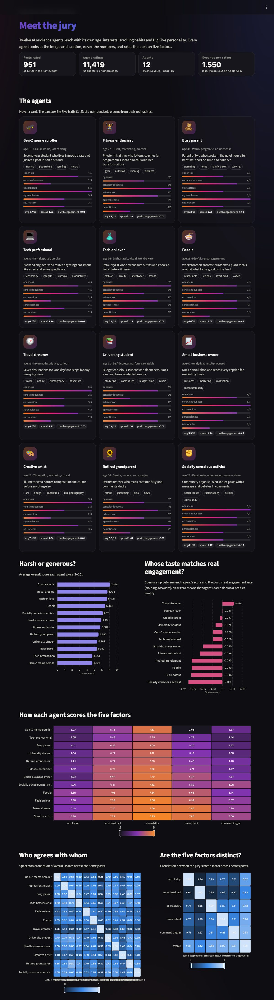

---

## 6. Phase 3: Machine learning models

### 6.1 Evaluation design

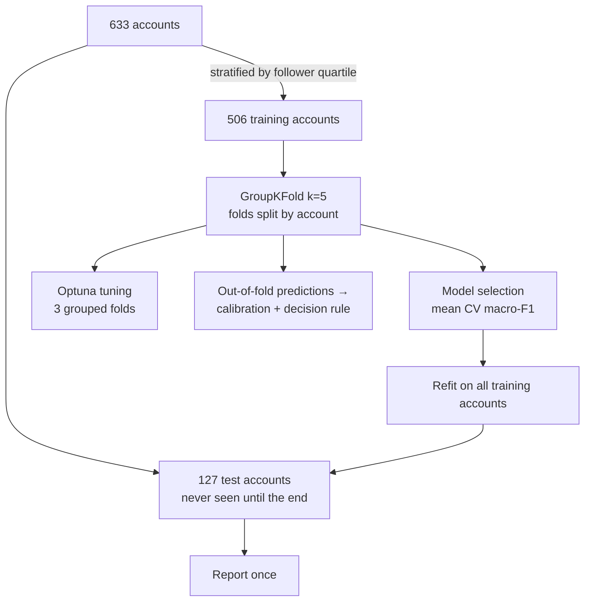
```mermaid
flowchart TB
    A[633 accounts] -->|stratified by follower quartile| B[506 training accounts]
    A --> C[127 test accounts<br/>never seen until the end]
    B --> D[GroupKFold k=5<br/>folds split by account]
    D --> E[Model selection<br/>mean CV macro-F1]
    D --> F[Optuna tuning<br/>3 grouped folds]
    D --> G[Out-of-fold predictions →<br/>calibration + decision rule]
    E --> H[Refit on all training accounts]
    H --> C
    C --> I[Report once]
```

**No account ever appears on both sides of a split.** That's tested for the test split and for every CV fold. All preprocessing (imputation, scaling, PCA) and SMOTE live **inside** the model pipeline, so they're re-fitted on the training part of every fold.

### 6.2 Algorithms

| Model | Idea | Key formula |
|---|---|---|
| **Logistic regression** (multinomial) | Linear scores → softmax | $P(y=k\mid\mathbf{x})=\dfrac{e^{\mathbf{w}_k^\top\mathbf{x}}}{\sum_j e^{\mathbf{w}_j^\top\mathbf{x}}}$, minimise $-\sum_i \log P(y_i\mid\mathbf{x}_i) + \tfrac{1}{2C}\lVert\mathbf{W}\rVert^2$ |
| **Random forest** | Bagged decision trees with random feature subsets | Split by Gini impurity $G=1-\sum_k p_k^2$; average the trees' class probabilities |
| **XGBoost** | Gradient-boosted trees, second-order | $\mathcal{L}=\sum_i \ell(y_i,\hat{y}_i)+\sum_t\left(\gamma T_t+\tfrac{\lambda}{2}\lVert\mathbf{w}_t\rVert^2\right)$; optimal leaf weight $w^*=-\dfrac{\sum g_i}{\sum h_i+\lambda}$ |
| **LightGBM** | Histogram-based, leaf-wise tree growth | Same boosting objective; grows the leaf with the largest loss reduction |
| **HistGradientBoosting** | scikit-learn's histogram boosting | Binned features, gradient boosting with multiclass log-loss |
| **Soft voting** | Average the probabilities of LogReg, RF, XGBoost, LightGBM | $P(k\mid\mathbf{x})=\tfrac{1}{M}\sum_m P_m(k\mid\mathbf{x})$ |
| **Stacking** | A logistic-regression meta-learner on base models' out-of-fold probabilities (inner CV also grouped by account) | $P(k\mid\mathbf{x}) = \text{LR}\big(P_1(\cdot\mid\mathbf{x}),\dots,P_M(\cdot\mid\mathbf{x})\big)$ |
| Dummy (stratified) | Random guess with class frequencies | The floor every model must beat |

### 6.3 Class imbalance (60 / 30 / 10)

| Strategy | How |
|---|---|
| **Class weights** | Sample weight $w_i = \dfrac{n}{K\,n_{y_i}}$, so each class contributes equally to the loss |
| **SMOTE** (inside an imblearn pipeline, training folds only) | A synthetic minority sample $\mathbf{x}_{\text{new}} = \mathbf{x}_i + \lambda(\mathbf{x}_{nn}-\mathbf{x}_i)$, with $\lambda\sim U(0,1)$ and $\mathbf{x}_{nn}$ one of the 5 nearest same-class neighbours |

Both strategies are compared for every model; the better one is chosen by CV.

### 6.4 Hyperparameter tuning: Optuna TPE

The Tree-structured Parzen Estimator models two densities over hyperparameters: $\ell(\theta)$ for trials in the top quantile $\gamma$ and $g(\theta)$ for the rest, then proposes the $\theta$ that maximises $\ell(\theta)/g(\theta)$.

- **Objective:** mean macro-F1 over **3 account-grouped folds of the training accounts**. The test set is never used.
- **Trials:** 25 per model.

| | Best CV macro-F1 | Selected parameters |
|---|---|---|
| XGBoost | 0.757 | 150 trees, depth 8, lr 0.051, subsample 0.95, colsample 0.83, λ 4.67 |
| LightGBM | 0.756 | 550 trees, 27 leaves, lr 0.018, subsample 0.96, colsample 0.96, min child 8, λ 0.06 |

### 6.5 Probability calibration and decision rule

Class weights and SMOTE make probabilities over-confident, so the app's "2% chance of Viral" wouldn't really mean 2%. Two fixes, both learned from **out-of-fold** predictions on the training accounts:

1. **Isotonic calibration:** for each class $k$, fit a monotone non-decreasing function $m_k$ minimising $\sum_i\big(\mathbb{1}[y_i=k]-m_k(p_{ik})\big)^2$, then renormalise each row to sum to 1.
2. **Macro-F1 decision rule:** predict $\hat{y}=\arg\max_k w_k\,\tilde{p}_k$, with $w_{\text{Low}}=1$ and $w_{\text{Moderate}}, w_{\text{Viral}}$ grid-searched to maximise out-of-fold macro-F1. Result: $w = (1.0,\ 1.2,\ 1.4)$.

How we measure calibration:

$$
\text{Brier} = \frac{1}{N}\sum_i\sum_k \big(p_{ik}-\mathbb{1}[y_i=k]\big)^2, \qquad
\text{ECE} = \sum_{b=1}^{10}\frac{|B_b|}{N}\,\Big|\overline{p}_{B_b}-\overline{y}_{B_b}\Big|
$$

### 6.6 Regression: engagement score

XGBoost on $\log_{10}(\text{ER}+10^{-6})$, evaluated with **Spearman's rank correlation**:

$$
\rho = 1-\frac{6\sum_i d_i^2}{n(n^2-1)}, \qquad d_i = \text{rank}(\hat{y}_i)-\text{rank}(y_i)
$$

The dashboard turns the predicted rate into a 0–100 **percentile within your follower tier**.

### 6.7 Unsupervised: K-Means content clusters

On the content features only (CLIP and MiniLM PCA components plus image and caption statistics), minimise $\sum_i\lVert\mathbf{x}_i-\boldsymbol{\mu}_{c(i)}\rVert^2$, choosing $k$ by the **silhouette score**:

$$
s(i)=\frac{b(i)-a(i)}{\max\lbrace a(i),b(i)\rbrace }
$$

where $a(i)$ is the mean distance to the post's own cluster and $b(i)$ the mean distance to the nearest other cluster.

### 6.8 Metrics (plain accuracy is never the headline)

$$
\text{Precision}_k=\frac{TP_k}{TP_k+FP_k},\quad \text{Recall}_k=\frac{TP_k}{TP_k+FN_k},\quad F1_k=\frac{2\,P_kR_k}{P_k+R_k}
$$

$$
\textbf{Macro-F1}=\frac{1}{3}\sum_k F1_k,\qquad \textbf{Balanced accuracy}=\frac{1}{3}\sum_k \text{Recall}_k,\qquad
\textbf{PR-AUC}_{\text{Viral}}=\sum_n (R_n-R_{n-1})P_n
$$

(PR-AUC is computed as average precision.) A random ranking has a Viral PR-AUC equal to the Viral prevalence, ≈ 0.10.

### 6.9 Explainability: SHAP

TreeSHAP computes each feature's Shapley value for the Viral log-odds:

$$
\phi_j=\sum_{S\subseteq F\setminus\lbrace j\rbrace }\frac{|S|!\,(|F|-|S|-1)!}{|F|!}\Big[f(S\cup\lbrace j\rbrace )-f(S)\Big]
$$

The 32 CLIP and 32 MiniLM components are **summed into one group each**, so explanations read "image content" or "caption meaning".

### 6.10 Statistical tests

- **Fold-paired one-sided t-test** for "model A beats B". The 5 folds are paired: $t=\bar{d}/(s_d/\sqrt{5})$, with $d$ the per-fold difference. "Helps" requires **p < 0.05 and a mean gain ≥ 0.01**.
- **Bootstrap 95% confidence intervals** (2,000 resamples) for bandit lifts.

---

## 7. Phase 4: Recommendation

### 7.1 Posting time: contextual bandits

- **Arms:** 8 three-hour UTC slots.
- **Context:** image and caption PCA components, follower tier and account history. The hour itself is never part of the context.
- **Reward:** $r = \mathbb{1}[\text{post is Moderate or Viral}]$.

| Policy | Rule |
|---|---|
| **LinUCB** | $a_t=\arg\max_a\ \hat{\boldsymbol{\theta}}_a^\top\mathbf{x}_t+\alpha\sqrt{\mathbf{x}_t^\top A_a^{-1}\mathbf{x}_t}$, with $A_a = I+\sum \mathbf{x}\mathbf{x}^\top$, $\hat{\boldsymbol{\theta}}_a=A_a^{-1}\mathbf{b}_a$ |
| **Linear Thompson sampling** | Sample $\tilde{\boldsymbol{\theta}}_a\sim\mathcal{N}(\hat{\boldsymbol{\theta}}_a,\alpha^2A_a^{-1})$, pick $\arg\max_a\tilde{\boldsymbol{\theta}}_a^\top\mathbf{x}_t$ |
| **Thompson sampling** (Beta-Bernoulli) | Sample $\tilde{p}_a\sim\text{Beta}(1+S_a,\,1+F_a)$, pick $\arg\max_a\tilde{p}_a$ |
| ε-greedy | Best arm with probability 0.9, random arm with probability 0.1 |
| Best fixed arm, random | Baselines |

**Offline evaluation by replay** (Li et al., 2011): walk the held-out posts in time order and count a post only when the policy picks the slot it was actually posted in. Replay is unbiased only if the logging policy was uniformly random. Creators choose their own times, so these results compare policies; they **do not** prove that posting at a different time would change engagement.

### 7.2 Caption style: bandit and LLM rewrites

- **Caption-style bandit:** the same policies over 18 arms, caption length (short / medium / long) × hashtags (0 / 1–5 / 6+) × question (yes / no). Per-tier **Beta posteriors** feed the "styles that work for accounts of your size" panel.
- **LLM caption variants:** the local VLM writes 3 rewrites, and the classifier rescores each one with everything else held fixed.
- **Suggestion engine:** a counterfactual search over all 167 other hour × weekday combinations, deterministic caption edits (add a question, remove or limit hashtags, shorten) and the AI variants. Changes are ranked by $\Delta = P(\text{Viral}\mid\text{change}) - P(\text{Viral}\mid\text{as planned})$.

---

## 8. Phase 5: Interactive dashboard

`make app` opens **http://localhost:8501**. The dashboard is a dark, animated UI:
- interactive **ECharts** that animate on load,
- count-up stat tiles and a glass/bento layout,
- a branded sidebar with a **live-model status card**,
- step-by-step **onboarding** on empty pages, and **toast** notifications when a result is ready,
- full `prefers-reduced-motion` support.

| Page | What it does |
|---|---|
| **Overview** | Headline results, where the accuracy comes from, what drives a Viral prediction, the AI jury |
| **Analyse a post** | Verdict and calibrated probabilities, engagement score, SHAP factors, **suggestions**, live **12-agent jury chat** + moderator summary, best posting slot (polar clock), caption variants, **what-if simulator** (hour, weekday, caption) |
| **A/B compare** | Two drafts side by side: winner, probabilities, why the winner wins (SHAP difference), fixes for each |
| **Meet the jury** | Agent cards (avatar, backstory, Big Five meters), harshness, whose taste tracks engagement, agreement heatmaps |
| **Explore predictions** | Filterable gallery of real held-out posts: true vs predicted class. Runs locally; not shown here because it displays dataset photos |
| **Model insights** | 9 tabs: CV comparison, Optuna history, confusion matrix, **threshold explorer**, ROC, calibration, cumulative gains, per-tier accuracy, SHAP, jury ablation, clusters, both bandits with forest plots, robustness and controls, data |
| **How it works** | Animated architecture diagram, guarantees, limitations, team |

### 8.1 Screenshots

**Overview:** headline results, model comparison, SHAP drivers, the AI jury


**Analyse a post: before you start.** Guided onboarding; the sidebar shows the live model

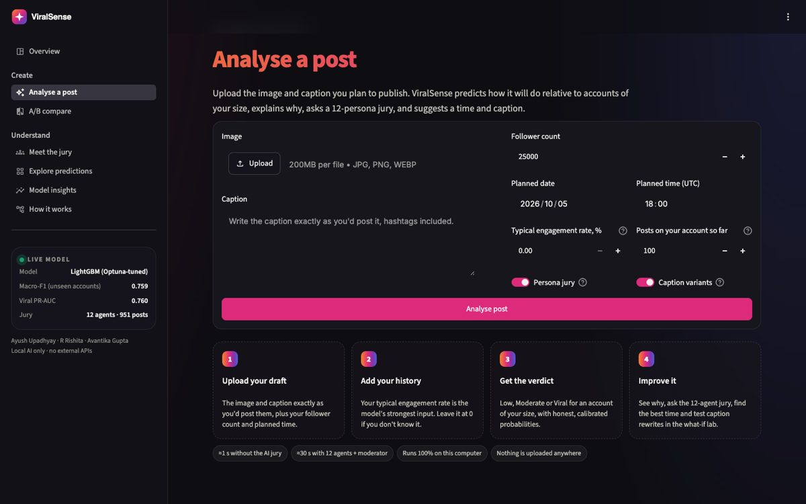

**Analyse a post: the full result.** Verdict and calibrated probabilities → SHAP "why" → ranked suggestions → persona-jury radar and best-time clock → the 12 agents' in-character reactions with the moderator's summary → caption variants

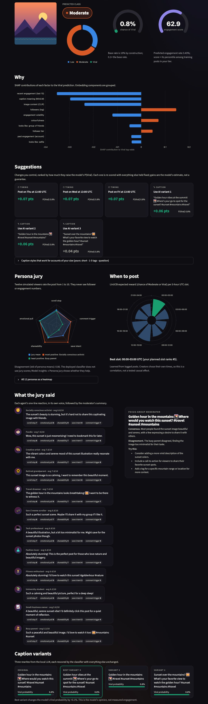

**A/B compare:** winner, class probabilities, why the winner scores higher, how to improve each draft


**Meet the jury:** 12 persona agents with Big Five meters, harshness, taste vs real engagement, agreement heatmaps


<details open>
<summary><b>Model insights (7 of the 9 tabs)</b></summary>

| | |
|---|---|
| **Overview:** CV macro-F1 for all models (class weights vs SMOTE), Optuna history, test table<br>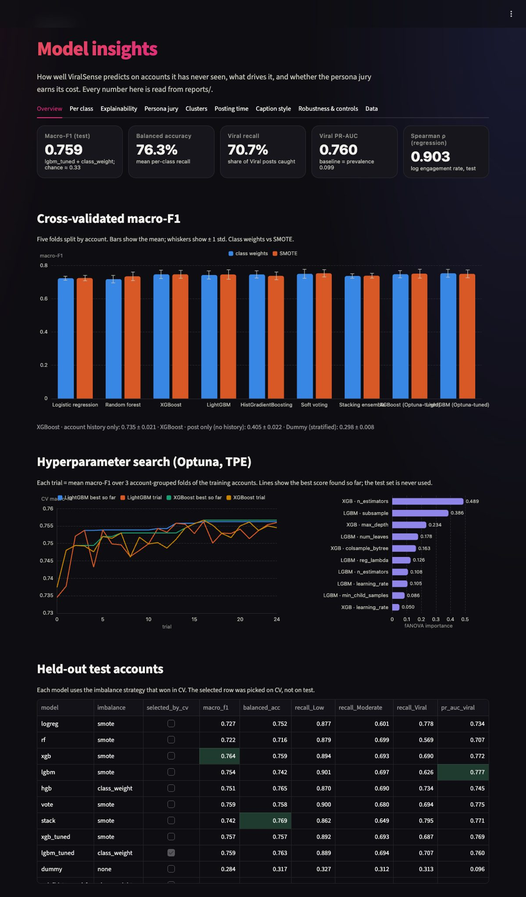 | **Per class:** confusion matrix, recall, PR curves, threshold explorer, ROC, calibration, gains, per-tier<br>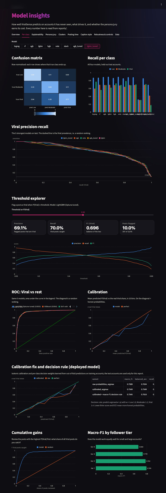 |
| **Explainability:** global SHAP importance<br>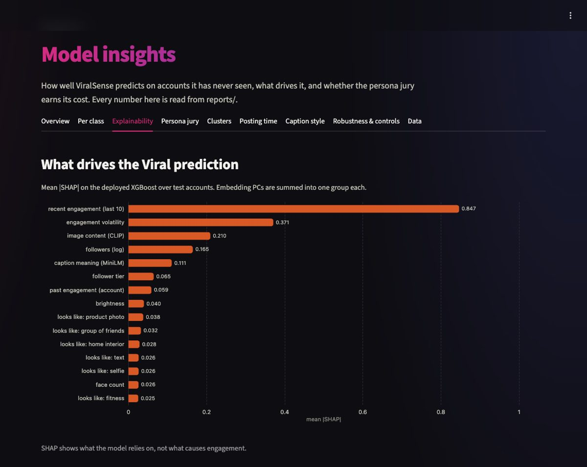 | **Persona jury:** ablation with paired t-test verdicts, jury scores by class<br>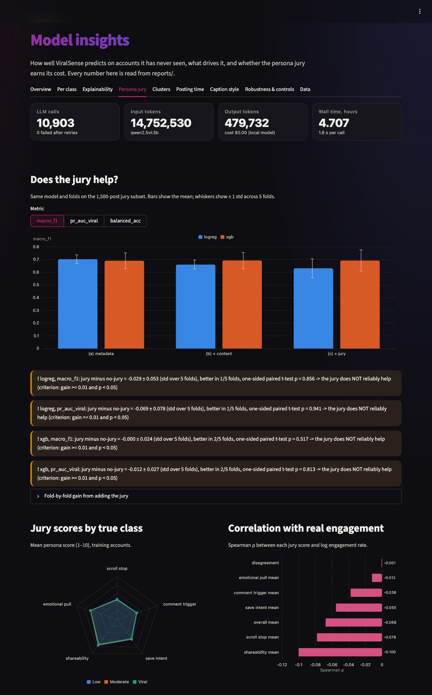 |
| **Clusters:** silhouette, content map, Viral share per cluster<br>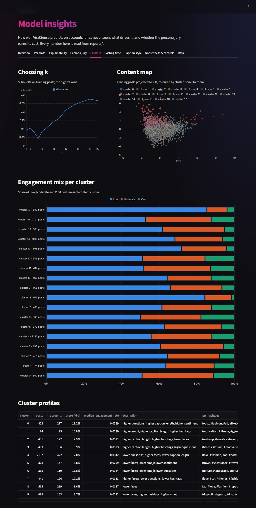 | **Posting time:** replay curves, bootstrap-CI forest plot, logged slots<br>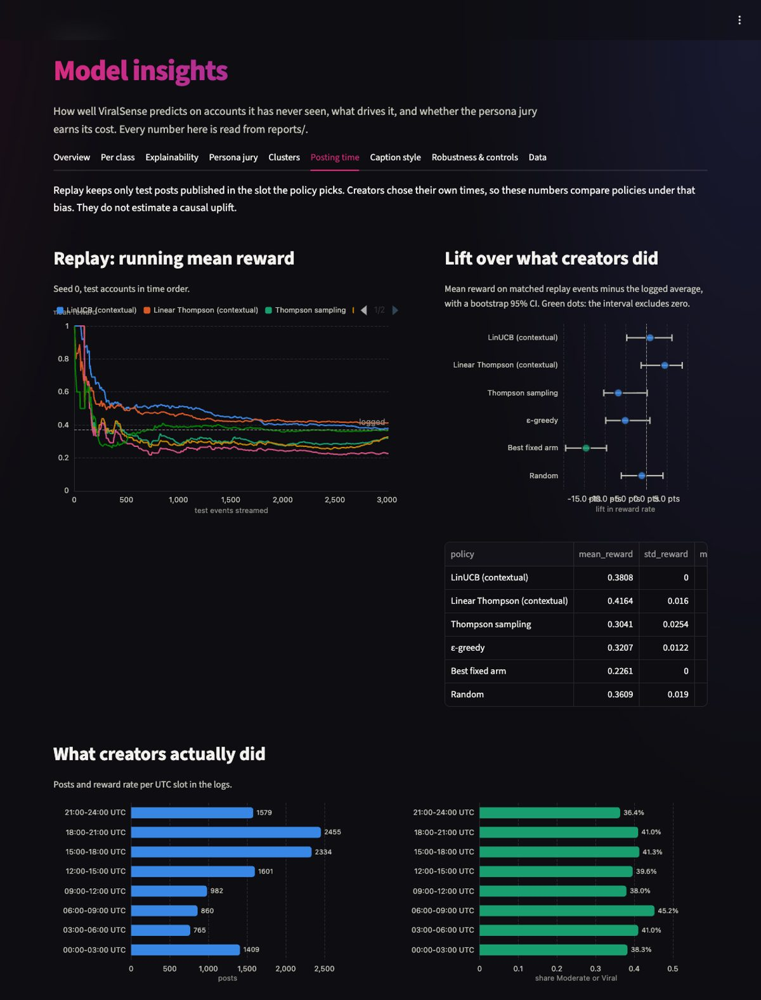 |
| **Robustness & controls:** time-ordered test, Kaggle negative control, leakage demo<br>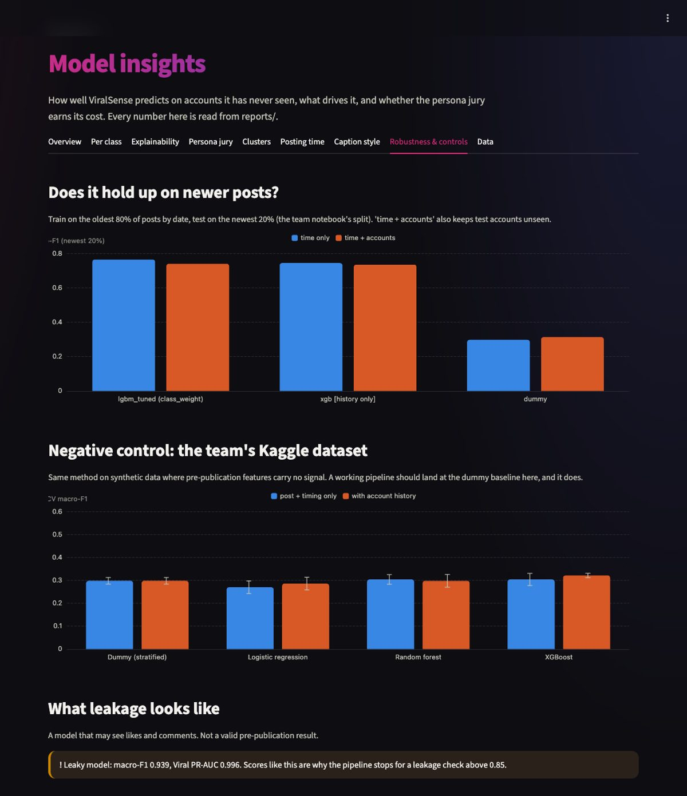 | **How it works:** animated architecture, six-step pipeline, guarantees<br>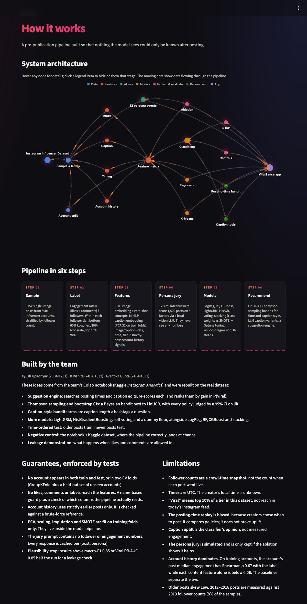 |

</details>

---

## 9. Results

All tables are saved as CSV in [`reports/tables/`](reports/tables) and all figures as PNG in [`reports/figures/`](reports/figures).

### 9.1 Cross-validation (5 account-grouped folds, training accounts)

| Model | Imbalance | Macro-F1 | Balanced acc. | Viral recall | Viral PR-AUC |
|---|---|---|---|---|---|
| **LightGBM (tuned)** ✓ selected | class weights | **0.752 ± 0.023** | 0.750 | 0.653 | 0.715 |
| Soft voting | SMOTE | 0.752 ± 0.022 | 0.751 | 0.657 | 0.717 |
| XGBoost (tuned) | SMOTE | 0.750 ± 0.027 | 0.751 | 0.665 | 0.708 |
| XGBoost | SMOTE | 0.746 ± 0.024 | 0.741 | 0.625 | 0.707 |
| HistGradientBoosting | class weights | 0.746 ± 0.022 | 0.736 | 0.602 | 0.703 |
| LightGBM | SMOTE | 0.745 ± 0.028 | 0.734 | 0.597 | 0.710 |
| Stacking | SMOTE | 0.738 ± 0.014 | 0.765 | 0.765 | 0.710 |
| Random forest | SMOTE | 0.734 ± 0.026 | 0.727 | 0.589 | 0.673 |
| Logistic regression | SMOTE | 0.724 ± 0.016 | 0.751 | 0.756 | 0.695 |
| *XGBoost: account history only* | class weights | 0.735 ± 0.021 | 0.747 | 0.680 | 0.693 |
| *XGBoost: post only (no history)* | class weights | 0.405 ± 0.022 | 0.408 | 0.121 | 0.161 |
| *Dummy (stratified)* | — | 0.298 ± 0.008 | 0.335 | 0.336 | 0.100 |

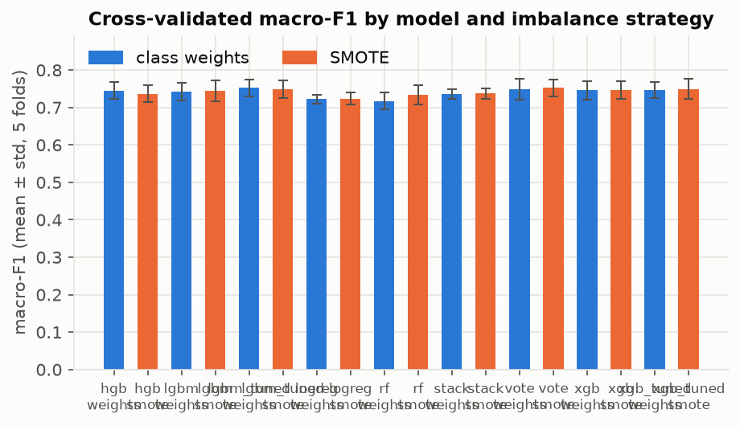

### 9.2 Held-out test (127 unseen accounts, 3,015 posts)

| Model | Macro-F1 | Balanced acc. | Recall Low | Recall Moderate | Recall Viral | Viral PR-AUC |
|---|---|---|---|---|---|---|
| **LightGBM (tuned)** ✓ | **0.759** | **0.763** | 0.889 | 0.694 | **0.707** | **0.760** |
| XGBoost | 0.764 | 0.759 | 0.894 | 0.693 | 0.690 | 0.772 |
| Soft voting | 0.759 | 0.758 | 0.900 | 0.680 | 0.694 | 0.775 |
| XGBoost (tuned) | 0.757 | 0.757 | 0.892 | 0.693 | 0.687 | 0.769 |
| LightGBM | 0.754 | 0.742 | 0.901 | 0.697 | 0.626 | 0.777 |
| HistGradientBoosting | 0.751 | 0.765 | 0.870 | 0.690 | 0.734 | 0.745 |
| Stacking | 0.742 | 0.769 | 0.862 | 0.649 | 0.795 | 0.771 |
| Logistic regression | 0.727 | 0.752 | 0.877 | 0.601 | 0.778 | 0.734 |
| Random forest | 0.722 | 0.716 | 0.879 | 0.699 | 0.569 | 0.707 |
| *Account history only* | 0.743 | 0.758 | 0.862 | 0.697 | 0.714 | 0.738 |
| *Post only* | 0.433 | 0.434 | 0.698 | 0.423 | 0.182 | 0.163 |
| *Dummy* | 0.284 | 0.317 | 0.327 | 0.312 | 0.313 | 0.096 |

The model was **selected by CV, not by test score**. XGBoost's slightly higher test macro-F1 (0.764) is within noise.

<p>
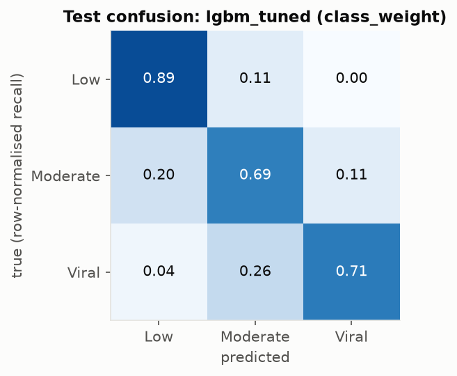 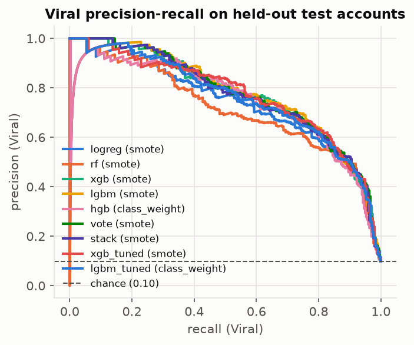
</p>

### 9.3 Does the post's content add anything beyond account history?

| Model vs "account history only" | Mean gain (macro-F1) | Folds better | p (one-sided) |
|---|---|---|---|
| LightGBM (tuned) | **+0.017 ± 0.010** | 5 / 5 | **0.009** ✓ |
| Soft voting (SMOTE) | +0.017 ± 0.010 | 4 / 5 | 0.009 ✓ |
| XGBoost (tuned, SMOTE) | +0.014 ± 0.009 | 5 / 5 | 0.013 ✓ |
| Logistic regression | −0.013 ± 0.014 | 1 / 5 | 0.949 ✗ |

**Yes: a small but significant amount, and only for the strong tree models.** On its own, content is weak (0.405 CV macro-F1), but above chance.

### 9.4 Calibration (deployed model, test accounts)

| Variant | Macro-F1 | Viral recall | Brier ↓ | ECE (Viral) ↓ |
|---|---|---|---|---|
| Raw probabilities | 0.759 | 0.707 | 0.262 | 0.020 |
| Calibrated | 0.755 | 0.710 | **0.256** | **0.015** |
| Calibrated + decision rule (deployed) | 0.755 | **0.724** | **0.256** | **0.015** |

Calibration makes the probabilities more honest (ECE −25%) at almost no cost in macro-F1, and the decision rule recovers Viral recall.

### 9.5 Engagement regression

| | Spearman ρ |
|---|---|
| CV (5 folds) | 0.895 ± 0.007 |
| **Test** | **0.903** |
| Account's past median alone (test) | 0.846 |

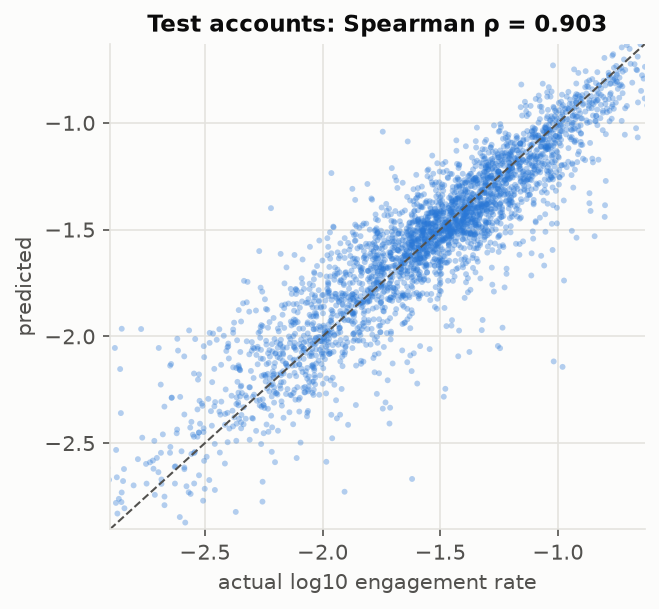

### 9.6 What drives a Viral prediction (mean |SHAP|, test)

| Rank | Factor | Mean \|SHAP\| |
|---|---|---|
| 1 | Recent engagement (last 10 posts) | 0.847 |
| 2 | Engagement volatility | 0.371 |
| 3 | Image content (CLIP, 32 components) | 0.210 |
| 4 | Followers (log) | 0.165 |
| 5 | Caption meaning (MiniLM, 32 components) | 0.111 |
| 6 | Follower tier | 0.065 |
| 7 | Past engagement (all-time median) | 0.059 |
| 8 | Brightness | 0.040 |
| 9 | Looks like: product photo | 0.038 |
| 10 | Looks like: group of friends | 0.032 |

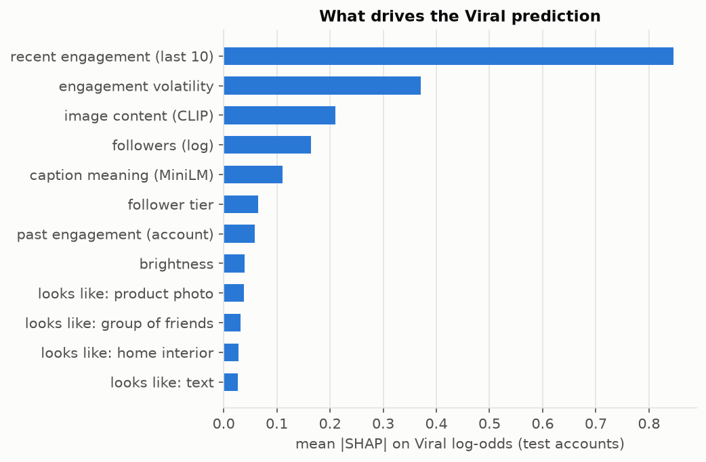

### 9.7 Persona-jury ablation (951-post subset, 5 grouped folds, 8-dim embeddings)

| Features | LogReg macro-F1 | XGBoost macro-F1 |
|---|---|---|
| (a) metadata (timing, size, account history) | **0.702 ± 0.034** | 0.690 ± 0.061 |
| (b) + content | 0.659 ± 0.036 | **0.692 ± 0.064** |
| (c) + content + **jury** | 0.630 ± 0.074 | 0.691 ± 0.084 |

| Jury minus no-jury | Gain | p | Verdict |
|---|---|---|---|
| LogReg, macro-F1 | −0.029 | 0.856 | does **not** help |
| LogReg, PR-AUC | −0.069 | 0.941 | does **not** help |
| XGBoost, macro-F1 | −0.000 | 0.517 | does **not** help |
| XGBoost, PR-AUC | −0.012 | 0.813 | does **not** help |

**Conclusion: the simulated jury does not predict real virality.** The agents' scores barely correlate with engagement (|ρ| ≤ 0.10). The jury's value in ViralSense is **qualitative**: explainable, in-character feedback in the app.

### 9.8 Robustness: does it hold up on newer posts?

Training on the oldest 80% of posts and testing on the newest 20%:

| Design | ViralSense | History only | Dummy |
|---|---|---|---|
| Time only (any account) | 0.764 | 0.744 | 0.297 |
| **Time + unseen accounts** | **0.739** | 0.734 | 0.313 |

### 9.9 Recommenders (replay on held-out accounts, bootstrap 95% CIs)

**Posting time** (logged average reward 0.371):

| Policy | Mean reward | Lift vs logged | 95% CI |
|---|---|---|---|
| Linear Thompson (contextual) | 0.416 | +0.045 | [−0.012, +0.087] |
| LinUCB (contextual) | 0.381 | +0.009 | [−0.047, +0.062] |
| Random | 0.361 | −0.011 | [−0.060, +0.041] |
| Thompson sampling | 0.304 | −0.067 | [−0.103, +0.002] |
| Best fixed slot | 0.226 | −0.145 | [−0.195, −0.096] |

**No policy beats what creators already did with confidence.** Posting time carries almost no signal in this data.

**Caption style:** Thompson (+0.145, CI [0.027, 0.188]), ε-greedy and best-fixed show significant lifts, **but these are correlational.** Accounts that write a given style differ in other ways too. LinUCB never matched a logged arm (no estimate).

**LLM caption variants** (29 of 30 test posts): the best variant beats the original 48% of the time, with a mean change in P(Viral) of +0.06 points. That's essentially no effect, as expected when the model leans on account history.

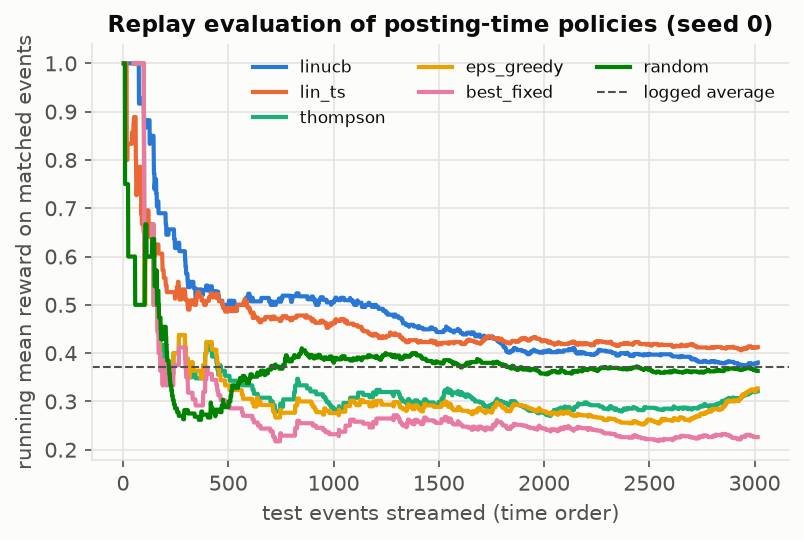

### 9.10 Content clusters (K-Means, k = 18, silhouette 0.275)

| Cluster theme (top hashtags) | Posts | Viral share |
|---|---|---|
| Nature and landscapes (#nature #landscape #sunset) | 365 | **17.8%** |
| Couples (#couple #couplegoals) | 645 | 15.7% |
| Beach travel (#beach #maldives) | 417 | 12.7% |
| Fashion / OOTD (#ootd #fashion #liketkit) | 2,191 | 12.4% |
| … | | |
| Home interiors (#homeinspo #interiordesign) | 395 | 4.3% |
| Recycling (#reciclaje #recycling) | 382 | 3.9% |
| Reposted jewellery / accessories ads (#repost #jewelry) | 515 | **1.6%** |

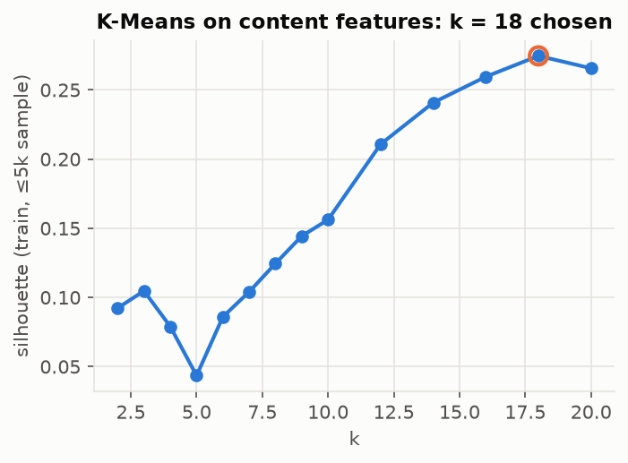

### 9.11 Controls

| Check | Result | Meaning |
|---|---|---|
| **Negative control:** our pipeline on the synthetic Kaggle *Instagram Analytics* data (no real signal) | Every model 0.27–0.32 macro-F1, the same as dummy (0.30) | The pipeline doesn't invent signal |
| **Leakage demo:** a model allowed to see likes and comments | **0.939** macro-F1, 0.996 PR-AUC | What leakage looks like, and why the guard exists |
| **Plausibility stop** | Any run above 0.85 macro-F1 or PR-AUC halts for a leakage check | Never triggered on valid models |

---

## 10. Leakage prevention and validity

| Risk | Safeguard | Enforced by |
|---|---|---|
| The same account in train and test | Account-disjoint test set; GroupKFold; grouped inner CV for stacking and tuning | `tests/test_splits.py` |
| Target-derived inputs | Name-based **leakage guard** (forbidden tokens: like, comment, engagement, er, label, viral …) with an explicit whitelist of strictly-past history features | `tests/test_leakage.py` |
| History "seeing" the present or future | Strictly earlier posts only, same-timestamp posts excluded; brute-force reference test | `tests/test_leakage.py` |
| Preprocessing fitted on test | PCA, scaler, imputer and SMOTE inside the pipeline | `tests/test_models.py` |
| Labels tuned on test | Tier edges and quantile cut-offs fitted on training accounts | `src/viralsense/data/prepare.py` |
| Selecting on test | Model, tuning, calibration and decision rule chosen on CV or out-of-fold predictions only | design |
| The jury seeing outcomes | Prompts contain no follower or engagement numbers | `tests/test_jury.py` |
| The new-post path missing inputs | Regression test that every model input exists for a brand-new post | `tests/test_models.py` |

---

## 11. Engineering

### 11.1 Repository layout

```
viralsense/
├── configs/
│   ├── config.yaml              one config: paths, sampling, labels, features, jury, models, bandits
│   └── personas.yaml            12 persona agents (interests, habits, Big Five, voice)
├── src/viralsense/
│   ├── data/                    split-zip reader, range image fetch, loader, sampling, history, split, labels
│   ├── features/                CLIP + concepts, MiniLM, VADER, image stats, metadata, leakage guard, report
│   ├── jury/                    Ollama client, persona prompts, cached runner, reactions, moderator, analytics
│   ├── models/                  classifiers, tuning, calibration, regression, K-Means, SHAP, ablation,
│   │                            temporal check, negative control, leakage demo, significance tests
│   ├── bandit/                  replay engine, posting-time & caption-style bandits, LLM caption variants
│   ├── suggest.py               counterfactual suggestion engine
│   ├── inference.py             feature pipeline for a new post, safe model loading
│   └── pipeline.py              runs any subset of the 15 stages in order
├── app/                         Streamlit dashboard (7 pages, ECharts, custom theme, logo in app/assets)
├── tests/                       77 tests
├── notebooks/01_eda.ipynb       exploration only
├── reports/tables/  · figures/  every result as CSV / PNG
├── docs/                        README screenshots and synthetic demo images
├── Makefile · requirements.lock reproducibility
└── teammateworl/                the team's exploratory Colab notebook (Kaggle data)
```

### 11.2 Tests (77, all passing)

| Area | What is checked |
|---|---|
| Splits | No account in both train and test or across CV folds; single-image only; 60/30/10 within tier; unique post IDs; mapping duplicates dropped |
| Leakage | Guard rejects target-derived columns; model inputs never include IDs or targets; every history feature equals a brute-force strictly-past reference; a post's own outcome never changes its features |
| Models | Every model × imbalance strategy fits and predicts; PCA fitted on training rows only; SMOTE training-only; no plain accuracy in metrics; calibration lowers ECE; the decision rule never lowers out-of-fold macro-F1; LightGBM predicts safely next to PyTorch |
| Jury | 12 unique personas; prompts contain no numbers; strict score validation; caching avoids repeat calls; panel mode makes 1 call per post |
| Data | Split-zip members read back byte-exact, including members that cross part boundaries |
| Suggestions and bandits | Caption edits; suggestions ranked by gain; style arms; bootstrap CI brackets the true gain |
| App | All 7 pages render with no results *and* with the real results; form keys never collide with session-state keys |

Several tests were **mutation-checked**: we planted a bug on purpose and confirmed that the test fails.

### 11.3 Performance (Apple M5, 16 GB)

| Step | Time |
|---|---|
| Features for a new post (CLIP + MiniLM + stats) | 0.17 s (11 s on first load) |
| Classifier prediction | 11 ms |
| Full analysis without LLM steps | ≈ 1 s |
| 12 jury reactions + moderator (local VLM) | ≈ 30 s, streamed |
| Training jury | 1.55 s per rating |

### 11.4 Notable engineering fixes

- **macOS OpenMP clash:** PyTorch and XGBoost/LightGBM bundle separate `libomp` copies, which segfault together. The fix is `OMP_NUM_THREADS=1` on import plus single-threaded prediction in the app (`inference.load_model`), with a regression test.
- **Split-zip random access:** the 19-part archive is read in place, and members that straddle part boundaries are handled.
- **Remote image access:** byte-range requests into the Google Drive archive with retries and JPEG validation.

---

## 12. How to run

**Requirements:** macOS or Linux, Python 3.11, [uv](https://github.com/astral-sh/uv), [Ollama](https://ollama.com). On macOS also run `brew install libomp`.

```bash
make setup                         # environment from the pinned requirements.lock
ollama serve &                     # local LLM server
ollama pull qwen2.5vl:3b           # 3.2 GB vision-language model
```

**Data:** request the Instagram Influencer Dataset from the authors' form. Then put `influencers.txt`, `JSON-Image_files_mapping.txt`, `drive_ids.json` and the 19 `Post_metadata/posts_info.*` parts in `data/raw/kim/`. Images are fetched automatically.

```bash
make all      # data → features → jury → models → recommenders → tests
make app      # dashboard on http://localhost:8501
```

Or run individual stages:

```bash
.venv/bin/python -m viralsense.pipeline --stages prepare features
.venv/bin/python -m viralsense.jury.run --limit 20          # jury pilot
.venv/bin/python -m viralsense.models.tune --trials 25
.venv/bin/python -m viralsense.pipeline --stages classify calibrate regress cluster ablation temporal control leakage compare
.venv/bin/python -m viralsense.pipeline --stages bandit caption_bandit captions
.venv/bin/python -m pytest
```

The fixed random seed (42) and the pinned dependency versions make runs reproducible.

---

## 13. Limitations and ethics

- **Follower counts are a crawl-time snapshot (2019),** not the count when each post went live. Older posts look worse; 92% of the sample is from 2017 or later.
- **Timestamps are UTC;** creators' local time is unknown.
- **"Viral" is relative:** it means the top 10% within a follower tier in this dataset, not reach in today's feed.
- **Bandit replay is biased** by creators' own choices; it ranks policies but doesn't prove causal uplift.
- **Caption uplift is the model's opinion,** not measured engagement. The 3B local model sometimes invents details in rewrites.
- **The jury is simulated:** its agents don't track real engagement, and a stronger model might behave differently.
- **Data licence:** the dataset is for research and education only. **No images or raw data are included in this repository.** Screenshots here show only charts and UI, with no dataset photos.
- **Privacy:** all AI runs locally. No data or images are sent to external APIs.

---

## 14. Team contributions

| Member | Registration |
|---|---|
| **Ayush Upadhyay** | 23BAI1231 |
| **R Rishita** | 24BAI1632 |
| **Avantika Gupta** | 24BAI1633 |

The project has two bodies of work:

- **Main pipeline on the real Instagram Influencer Dataset** (this repository): data engineering, features, persona jury, models, recommenders, dashboard and evaluation.
- **The team's exploratory Colab study** ([`teammateworl/`](teammateworl)), on the Kaggle *Instagram Analytics* data: a leakage audit, a rule-based persona jury, a model grid with ensembles, Thompson-sampling bandits, a suggestion engine and an export for deployment.

**Ideas from the Colab study rebuilt here on the real dataset:**
- the suggestion engine
- Thompson sampling with bootstrap confidence intervals
- the caption-style bandit
- LightGBM, HistGB, soft voting and the dummy baseline
- the time-ordered test
- the Kaggle dataset as a **negative control**
- the post-publication leakage demonstration

**Not carried over:**
- **The rule-based jury.** It is a formula of features the model already sees; the LLM jury replaces it.
- **`traffic_source`.** It is only known after posting.
- **`best_path.pth`.** It is a pickle tied to the Kaggle features.

---

## 15. References

- Kim, S., Jiang, J.-Y., Nakada, M., Han, J., & Wang, W. (2020). *Multimodal Post Attentive Profiling for Influencer Marketing.* The Web Conference (WWW).
- Radford, A. et al. (2021). *Learning Transferable Visual Models From Natural Language Supervision* (CLIP). ICML. OpenCLIP, LAION-2B weights.
- Reimers, N. & Gurevych, I. (2019). *Sentence-BERT.* EMNLP. Model `all-MiniLM-L6-v2`.
- Hutto, C. & Gilbert, E. (2014). *VADER: A Parsimonious Rule-based Model for Sentiment Analysis of Social Media Text.* ICWSM.
- Hasler, D. & Süsstrunk, S. (2003). *Measuring Colourfulness in Natural Images.* SPIE.
- Chawla, N. et al. (2002). *SMOTE: Synthetic Minority Over-sampling Technique.* JAIR.
- Chen, T. & Guestrin, C. (2016). *XGBoost: A Scalable Tree Boosting System.* KDD.
- Ke, G. et al. (2017). *LightGBM: A Highly Efficient Gradient Boosting Decision Tree.* NeurIPS.
- Akiba, T. et al. (2019). *Optuna: A Next-generation Hyperparameter Optimization Framework.* KDD. Bergstra, J. et al. (2011). *Algorithms for Hyper-Parameter Optimization* (TPE). NeurIPS.
- Zadrozny, B. & Elkan, C. (2002). *Transforming Classifier Scores into Accurate Multiclass Probability Estimates.* KDD.
- Lundberg, S. & Lee, S.-I. (2017). *A Unified Approach to Interpreting Model Predictions* (SHAP). NeurIPS.
- Li, L., Chu, W., Langford, J., & Schapire, R. (2010). *A Contextual-Bandit Approach to Personalized News Article Recommendation* (LinUCB). WWW.
- Li, L., Chu, W., Langford, J., & Wang, X. (2011). *Unbiased Offline Evaluation of Contextual-bandit-based News Article Recommendation Algorithms* (replay). WSDM.
- Agrawal, S. & Goyal, N. (2013). *Thompson Sampling for Contextual Bandits with Linear Payoffs.* ICML.
- Qwen Team (2025). *Qwen2.5-VL Technical Report.* Served locally with Ollama.
- Microsoft (2024). *TinyTroupe*, which inspired the persona-agent design.

<div align="center">

**ViralSense** · Ayush Upadhyay · R Rishita · Avantika Gupta

</div>
